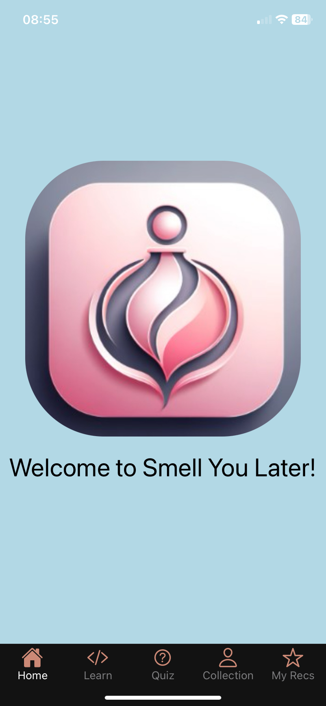
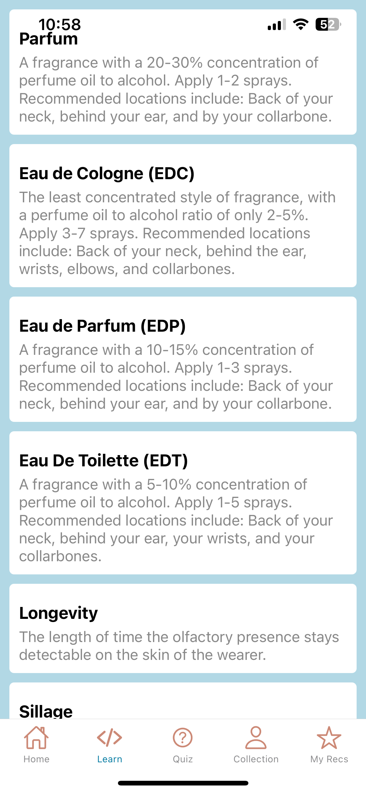
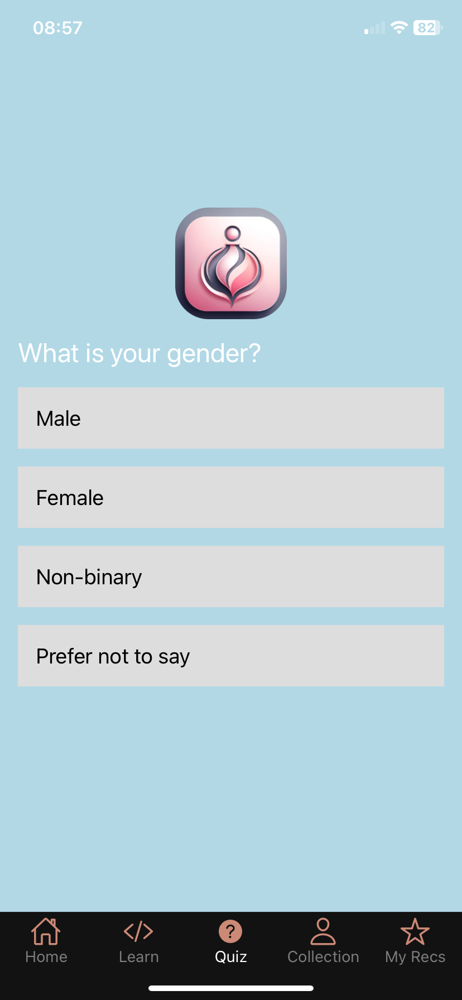
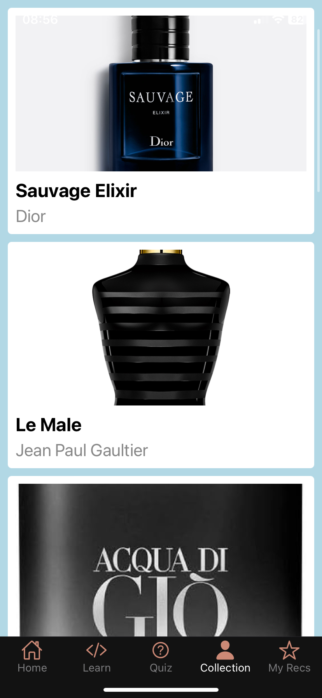

# Fragrance-Max
### UCI VenusHacks 2024 
Coded by: Brandy Nguyen, David Nguyen, Huan Nguyen

Project created using `npx create-expo-app@latest`
[Demo video](https://youtu.be/kjbxZJkhO7M)

---
### How To Run:

- Install all dependencies with `npm install`

- Initiate development server with `npx expo start`

- IGNORE vulnerabilities

- Connect mobile device via scanning the qr code in the terminal using your mobile device's cameria on IOS or the expo go app on Android

---
### Backend Setup

- Install dependencies `pip install openpyxl scikit-learn numpy pandas fastapi uvicorn google-generativeai pymongo dnspython`

- CD into backend/src

- to run locally: `python -m uvicorn main:app --reload`

- to run on deployment machine: TBA

---
### References:
- React Native setup guide: https://reactnative.dev/docs/environment-setup
- React Navigation: https://reactnavigation.org/docs/getting-started
- React Native core components: https://reactnative.dev/docs/components-and-apis
- Dataset was retrieved from along with a bit of data preprocessing: https://github.com/rdemarqui/perfume_recommender
- FastAPI guide: https://fastapi.tiangolo.com/
- Google Gemini API: https://ai.google.dev/
- Jupyter Notebook Install: https://jupyter.org/install
  
---
### App Photos
**Homepage:**

**Terms Learn page:**

**Quiz page:**

**Collections page:**

